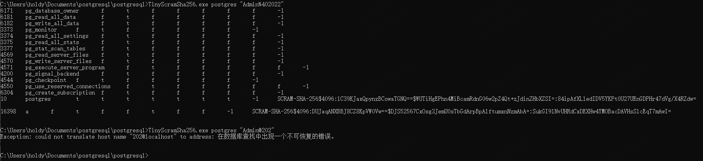

<h1 align="center">Welcome to Conn-PostgreSQL-cpp 👋</h1>
<p>
  
</p>


> connection postgresql with pqxx (using c++)

### 🏠 [Homepage](holdyounger.github.io)

## Author

👤 **holdyounger**

* Github: [@holdyounger](https://github.com/holdyounger)

## How to complie pqxx.lib

> 概述：windows下编译libpq
>
> :dango: 注意1：PostgreSQL 从版本10之后就只有64位了。使用pqxx也不用考虑32位
>
> 使用版本说明：
>
> - PostGreSQL: 16.1
> - pqxx: 7.7.6
>
> :dango: 注意2: pqxx 使用的是 C++17


<!--more-->

### 0x01 前言

what: The official C++ client API for PostgreSQL.

### 0x02 下载源码

- postgresql二进制文件下载链接 [Community DL Page](https://www.enterprisedb.com/download-postgresql-binaries)

- pqxx [jtv/libpqxx at 7.7](https://github.com/jtv/libpqxx/tree/7.7)

源码仓库提供了windows下快速编译libpq的方法。但不好用，本人尝试但未能成功。

- Easy-PQXX-Build-for-Windows-Visual-Studio [GordonLElliott/Easy-PQXX-Build-for-Windows-Visual-Studio: Quickly build libpqxx, the official C++ client API for PostgreSQL, in Windows environment with Visual Studio. Create both Debug and Release configurations with optional efficiency patches, install in Program Files directory, create property sheets to easily use in Visual Studio applications, with named versions for configurations, and options.](https://github.com/GordonLElliott/Easy-PQXX-Build-for-Windows-Visual-Studio)

### 0x03 使用 cmake 编译 pqxx

#### 编译

编译 pqxx 需要 PostGreSQL 的运行环境，因此需要下载二进制包才能编译成功。去 PostgreSQL 官网下载安装包或者二进制包都可以。

下载完成后，分两种情况，如果是下载的安装包，安装 postgresql 后直接用 cmake 编译就可以了，如果下载的是二进制文件，则需要配置cmake的变量如下所示，直接修改根目录的 `CMakeLists.txt`

```cmake
cmake_minimum_required(VERSION 3.8)

file(READ VERSION VER_FILE_CONTENT)
string(STRIP ${VER_FILE_CONTENT} VER_FILE_CONTENT)

project(
    libpqxx
    VERSION ${VER_FILE_CONTENT}
    LANGUAGES CXX
)

# 在这里声明 postgresql 的二进制根目录，根据个人下情况配置即可
set(PostgreSQL_ROOT "D:\\Documents\\postgresql\\postgresql-16.1-1-windows-x64-binaries\\pgsql")

if(NOT "${CMAKE_CXX_STANDARD}")
    set(CMAKE_CXX_STANDARD 17)
endif()
set(CMAKE_CXX_STANDARD_REQUIRED ON)
set(CMAKE_CXX_EXTENSIONS OFF)
set(CMAKE_MODULE_PATH ${PROJECT_SOURCE_DIR}/cmake)
```

然后就是使用 `cmake` 编译了，目前 VSCode 和 Visual Studio 都支持 CMake 文件的编译，直接编译即可。

这里使用 Visual Studio 编译后，会在 out 目录下生成lib文件，如下所示：

```
D:\Documents\A_Source\OpenSource\libpqxx\out>tree /F
卷 本地磁盘 的文件夹 PATH 列表
卷序列号为 724D-690E
D:.
├─build
│  └─x64-Debug
│      │  .ninja_deps
│      │  .ninja_log
│      │  build.ninja
│      │  CMakeCache.txt
│      │  cmake_install.cmake
│      │  CPackConfig.cmake
│      │  CPackSourceConfig.cmake
│      │  install_manifest.txt
│      │  libpqxx-config-version.cmake
│      │  libpqxx-config.cmake
│      │  libpqxx-targets.cmake
│      │  libpqxx.pc
│      │  VSInheritEnvironments.txt
│      │
│      ├─.cmake
│      │  └─api
│      │      └─v1
│      │          ├─query
│      │          │  └─client-MicrosoftVS
│      │          │          query.json
│      │          │
│      │          └─reply
│      │                  cache-v2-4c1f3ae5d14ffd09e2dd.json
│      │                  cmakeFiles-v1-6f2def4807820d15719b.json
│      │                  codemodel-v2-8933aef952d7508a3af3.json
│      │                  directory-.-Debug-6b54e12c0d4bd01edfca.json
│      │                  directory-include-Debug-ba96d77232f254970ce6.json
│      │                  directory-src-Debug-5d1cc30954eb9bce3508.json
│      │                  directory-test-Debug-f18be1977b403cfd1a50.json
│      │                  index-2023-11-16T09-03-01-0309.json
│      │                  target-pqxx-Debug-08c4b9d672ef282e41c8.json
│      │                  target-runner-Debug-b625a8b78dd4666c4f11.json
│      │                  toolchains-v1-3b995f712f6d6e9a85c1.json
│      │
│      ├─CMakeFiles
│      │  │  cmake.check_cache
│      │  │  CMakeConfigureLog.yaml
│      │  │  rules.ninja
│      │  │  TargetDirectories.txt
│      │  │
│      │  ├─3.26.4-msvc4
│      │  │  │  CMakeCXXCompiler.cmake
│      │  │  │  CMakeDetermineCompilerABI_CXX.bin
│      │  │  │  CMakeRCCompiler.cmake
│      │  │  │  CMakeSystem.cmake
│      │  │  │
│      │  │  └─CompilerIdCXX
│      │  │      │  CMakeCXXCompilerId.cpp
│      │  │      │  CMakeCXXCompilerId.exe
│      │  │      │  CMakeCXXCompilerId.obj
│      │  │      │
│      │  │      └─tmp
│      │  ├─CMakeTmp
│      │  ├─Export
│      │  │  └─d6b66e93f8212dd1f00debf9f6654819
│      │  │          libpqxx-targets-debug.cmake
│      │  │          libpqxx-targets.cmake
│      │  │
│      │  ├─pkgRedirects
│      │  └─ShowIncludes
│      │          foo.h
│      │          main.c
│      │          main.obj
│      │
│      ├─include
│      │  │  cmake_install.cmake
│      │  │
│      │  ├─CMakeFiles
│      │  └─pqxx
│      │          config-internal-compiler.h
│      │          config-internal-libpq.h
│      │          config-public-compiler.h
│      │          config_cmake.h.in
│      │
│      ├─src
│      │  │  cmake_install.cmake
│      │  │  pqxx.lib
│      │  │
│      │  └─CMakeFiles
│      │      └─pqxx.dir
│      │              array.cxx.obj
│      │              binarystring.cxx.obj
│      │              blob.cxx.obj
│      │              connection.cxx.obj
│      │              cursor.cxx.obj
│      │              encodings.cxx.obj
│      │              errorhandler.cxx.obj
│      │              except.cxx.obj
│      │              field.cxx.obj
│      │              largeobject.cxx.obj
│      │              notification.cxx.obj
│      │              params.cxx.obj
│      │              pipeline.cxx.obj
│      │              pqxx.pdb
│      │              result.cxx.obj
│      │              robusttransaction.cxx.obj
│      │              row.cxx.obj
│      │              sql_cursor.cxx.obj
│      │              strconv.cxx.obj
│      │              stream_from.cxx.obj
│      │              stream_to.cxx.obj
│      │              subtransaction.cxx.obj
│      │              time.cxx.obj
│      │              transaction.cxx.obj
│      │              transaction_base.cxx.obj
│      │              util.cxx.obj
│      │              version.cxx.obj
│      │              wait.cxx.obj
│      │
│      ├─test
│      │  │  cmake_install.cmake
│      │  │  CTestTestfile.cmake
│      │  │  runner.exe
│      │  │  runner.ilk
│      │  │  runner.pdb
│      │  │
│      │  └─CMakeFiles
│      │      └─runner.dir
│      │          │  embed.manifest
│      │          │  intermediate.manifest
│      │          │  manifest.rc
│      │          │  manifest.res
│      │          │  runner.cxx.obj
│      │          │  test00.cxx.obj
│      │          │  test01.cxx.obj
│      │          │  test02.cxx.obj
│      │          │  test04.cxx.obj
│      │          │  test07.cxx.obj
│      │          │  test10.cxx.obj
│      │          │  test11.cxx.obj
│      │          │  test13.cxx.obj
│      │          │  test14.cxx.obj
│      │          │  test16.cxx.obj
│      │          │  test17.cxx.obj
│      │          │  test18.cxx.obj
│      │          │  test20.cxx.obj
│      │          │  test21.cxx.obj
│      │          │  test26.cxx.obj
│      │          │  test29.cxx.obj
│      │          │  test30.cxx.obj
│      │          │  test32.cxx.obj
│      │          │  test37.cxx.obj
│      │          │  test39.cxx.obj
│      │          │  test46.cxx.obj
│      │          │  test56.cxx.obj
│      │          │  test60.cxx.obj
│      │          │  test61.cxx.obj
│      │          │  test62.cxx.obj
│      │          │  test69.cxx.obj
│      │          │  test70.cxx.obj
│      │          │  test71.cxx.obj
│      │          │  test72.cxx.obj
│      │          │  test74.cxx.obj
│      │          │  test75.cxx.obj
│      │          │  test76.cxx.obj
│      │          │  test77.cxx.obj
│      │          │  test78.cxx.obj
│      │          │  test79.cxx.obj
│      │          │  test82.cxx.obj
│      │          │  test84.cxx.obj
│      │          │  test87.cxx.obj
│      │          │  test88.cxx.obj
│      │          │  test89.cxx.obj
│      │          │  test90.cxx.obj
│      │          │  vc140.pdb
│      │          │
│      │          └─unit
│      │                  test_array.cxx.obj
│      │                  test_binarystring.cxx.obj
│      │                  test_blob.cxx.obj
│      │                  test_cancel_query.cxx.obj
│      │                  test_column.cxx.obj
│      │                  test_composite.cxx.obj
│      │                  test_connection.cxx.obj
│      │                  test_cursor.cxx.obj
│      │                  test_encodings.cxx.obj
│      │                  test_errorhandler.cxx.obj
│      │                  test_error_verbosity.cxx.obj
│      │                  test_escape.cxx.obj
│      │                  test_exceptions.cxx.obj
│      │                  test_field.cxx.obj
│      │                  test_float.cxx.obj
│      │                  test_largeobject.cxx.obj
│      │                  test_nonblocking_connect.cxx.obj
│      │                  test_notification.cxx.obj
│      │                  test_pipeline.cxx.obj
│      │                  test_prepared_statement.cxx.obj
│      │                  test_range.cxx.obj
│      │                  test_read_transaction.cxx.obj
│      │                  test_result_iteration.cxx.obj
│      │                  test_result_slicing.cxx.obj
│      │                  test_row.cxx.obj
│      │                  test_separated_list.cxx.obj
│      │                  test_simultaneous_transactions.cxx.obj
│      │                  test_sql_cursor.cxx.obj
│      │                  test_stateless_cursor.cxx.obj
│      │                  test_strconv.cxx.obj
│      │                  test_stream_from.cxx.obj
│      │                  test_stream_to.cxx.obj
│      │                  test_string_conversion.cxx.obj
│      │                  test_subtransaction.cxx.obj
│      │                  test_test_helpers.cxx.obj
│      │                  test_thread_safety_model.cxx.obj
│      │                  test_time.cxx.obj
│      │                  test_transaction.cxx.obj
│      │                  test_transaction_base.cxx.obj
│      │                  test_transaction_focus.cxx.obj
│      │                  test_transactor.cxx.obj
│      │                  test_type_name.cxx.obj
│      │                  test_zview.cxx.obj
│      │
│      └─Testing
│          └─Temporary
│                  LastTest.log
│
└─install
    └─x64-Debug
        ├─include
        │  └─pqxx
        │      │  array
        │      │  array.hxx
        │      │  binarystring
        │      │  binarystring.hxx
        │      │  blob
        │      │  blob.hxx
        │      │  composite
        │      │  composite.hxx
        │      │  config-public-compiler.h
        │      │  connection
        │      │  connection.hxx
        │      │  cursor
        │      │  cursor.hxx
        │      │  dbtransaction
        │      │  dbtransaction.hxx
        │      │  errorhandler
        │      │  errorhandler.hxx
        │      │  except
        │      │  except.hxx
        │      │  field
        │      │  field.hxx
        │      │  isolation
        │      │  isolation.hxx
        │      │  largeobject
        │      │  largeobject.hxx
        │      │  nontransaction
        │      │  nontransaction.hxx
        │      │  notification
        │      │  notification.hxx
        │      │  params
        │      │  params.hxx
        │      │  pipeline
        │      │  pipeline.hxx
        │      │  pqxx
        │      │  prepared_statement
        │      │  prepared_statement.hxx
        │      │  range
        │      │  range.hxx
        │      │  result
        │      │  result.hxx
        │      │  robusttransaction
        │      │  robusttransaction.hxx
        │      │  row
        │      │  row.hxx
        │      │  separated_list
        │      │  separated_list.hxx
        │      │  strconv
        │      │  strconv.hxx
        │      │  stream_from
        │      │  stream_from.hxx
        │      │  stream_to
        │      │  stream_to.hxx
        │      │  subtransaction
        │      │  subtransaction.hxx
        │      │  time
        │      │  time.hxx
        │      │  transaction
        │      │  transaction.hxx
        │      │  transaction_base
        │      │  transaction_base.hxx
        │      │  transaction_focus
        │      │  transaction_focus.hxx
        │      │  transactor
        │      │  transactor.hxx
        │      │  types
        │      │  types.hxx
        │      │  util
        │      │  util.hxx
        │      │  version
        │      │  version.hxx
        │      │  zview
        │      │  zview.hxx
        │      │
        │      └─internal
        │          │  array-composite.hxx
        │          │  callgate.hxx
        │          │  concat.hxx
        │          │  conversions.hxx
        │          │  encodings.hxx
        │          │  encoding_group.hxx
        │          │  header-post.hxx
        │          │  header-pre.hxx
        │          │  ignore-deprecated-post.hxx
        │          │  ignore-deprecated-pre.hxx
        │          │  libpq-forward.hxx
        │          │  result_iter.hxx
        │          │  result_iterator.hxx
        │          │  sql_cursor.hxx
        │          │  statement_parameters.hxx
        │          │  stream_iterator.hxx
        │          │  wait.hxx
        │          │
        │          └─gates
        │                  connection-errorhandler.hxx
        │                  connection-largeobject.hxx
        │                  connection-notification_receiver.hxx
        │                  connection-pipeline.hxx
        │                  connection-sql_cursor.hxx
        │                  connection-stream_from.hxx
        │                  connection-stream_to.hxx
        │                  connection-transaction.hxx
        │                  errorhandler-connection.hxx
        │                  icursorstream-icursor_iterator.hxx
        │                  icursor_iterator-icursorstream.hxx
        │                  result-connection.hxx
        │                  result-creation.hxx
        │                  result-pipeline.hxx
        │                  result-sql_cursor.hxx
        │                  transaction-sql_cursor.hxx
        │                  transaction-transaction_focus.hxx
        │
        ├─lib
        │  │  pqxx.lib
        │  │
        │  ├─cmake
        │  │  └─libpqxx
        │  │          libpqxx-config-version.cmake
        │  │          libpqxx-config.cmake
        │  │          libpqxx-targets-debug.cmake
        │  │          libpqxx-targets.cmake
        │  │
        │  └─pkgconfig
        │          libpqxx.pc
        │
        └─share
            └─doc
                └─libpqxx
                        accessing-results.md
                        binary-data.md
                        datatypes.md
                        escaping.md
                        getting-started.md
                        mainpage.md
                        parameters.md
                        performance.md
                        prepared-statement.md
                        streams.md
                        thread-safety.md
```

⚠ 然后就可以编代码使用 pqxx.lib 了。除此之外，在编译项目时还需要添加 libpq.lib.

除此之外可以看到以下两个目录，这两个目录待会要引入到 VS 工程中：

- include：D:\Documents\A_Source\OpenSource\libpqxx\out\install\x64-Debug\include
- lib: D:\Documents\A_Source\OpenSource\libpqxx\out\install\x64-Debug\lib

- 还需引入 libpq.lib 的目录。

#### 使用

以下代码可直接使用，自测是没问题的。

如果有编译报错 `C4996: '_Header_ciso646'`，关闭 ==SDL检查== 再编译试试。

另外补充一点，编译的PE文件运行时依赖很多dll，包括但不限于 libpq.dll、libssl 等，可以选择部署到另外一台机器上，同时部署 C++ 运行时文件。

```cpp
#include <iostream>
#include <windows.h>
#include <pqxx/pqxx>
#include <pqxx/transaction>

int main(int argc, char* argv[])
{
    // (Normally you'd check for valid command-line arguments.)

    if (argc < 3)
    {
        printf("Usage:\n %s <username> <password>", argv[0]);
        exit(-1);
    }

    char conn[MAX_PATH];

    sprintf(conn, "postgresql://%s:%s@localhost/postgres", argv[1], argv[2]);

    try
    {
        pqxx::connection c{ conn };
        pqxx::work txn{ c };

        // For querying just one single value, the transaction has a shorthand method
        // query_value().
        //
        // Use txn.quote() to escape and quote a C++ string for use as an SQL string
        // in a query's text.
        pqxx::result res = txn.exec("SELECT * FROM pg_authid");

        for (int i = 0; i < res.size(); i++)
        {
            for(int j = 0; j < res[i].size(); j++)
                std::cout << "" << res[i].at(j) << '\t';

            std::cout << '\n';
        }
    }
    catch (std::bad_alloc const&)
    {
        std::cerr << "Out of memory!" << std::endl;
    }
    catch (pqxx::sql_error const& e)
    {
        std::cerr << "SQL error: " << e.what() << std::endl
            << "Query was: " << e.query() << std::endl;
    }
    catch (std::exception const& e)
    {
        std::cerr << "Exception: " << e.what() << std::endl;
    }
    catch (...)
    {
        std::cerr << "Unknown exception" << std::endl;
    }
}
```

在安装postgresql的机器上输出如下所示：



## Show your support

Give a ⭐️ if this project helped you!

***
_This README was generated with ❤️ by [readme-md-generator](https://github.com/kefranabg/readme-md-generator)_